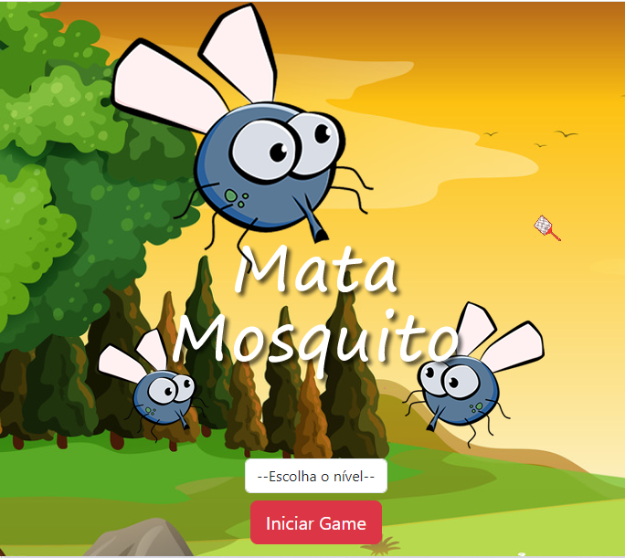
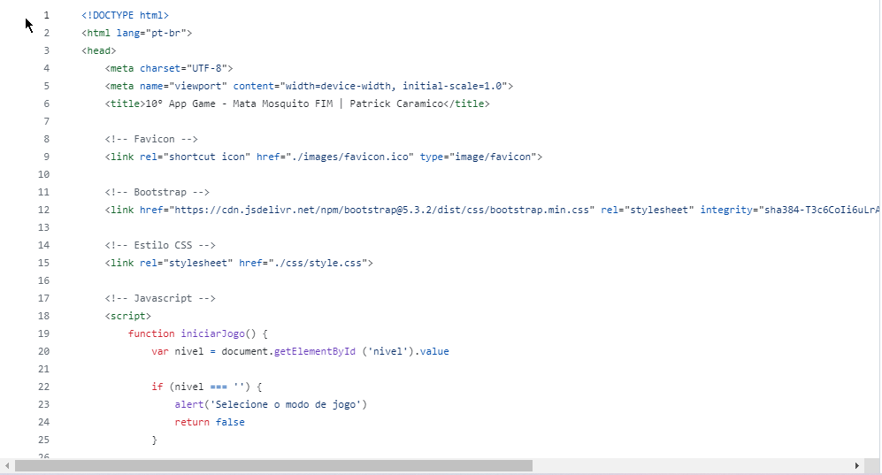
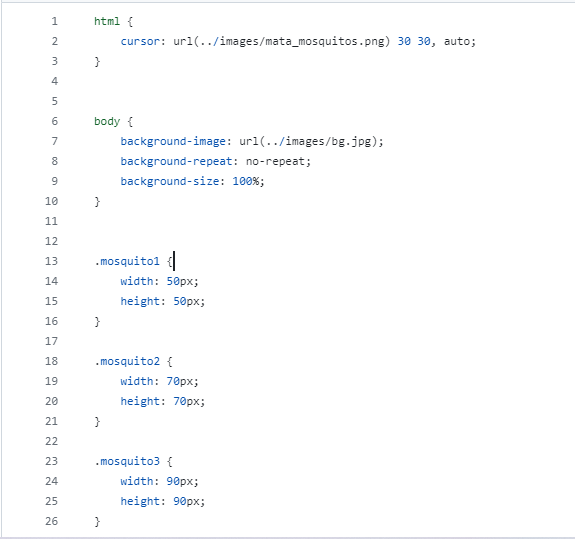
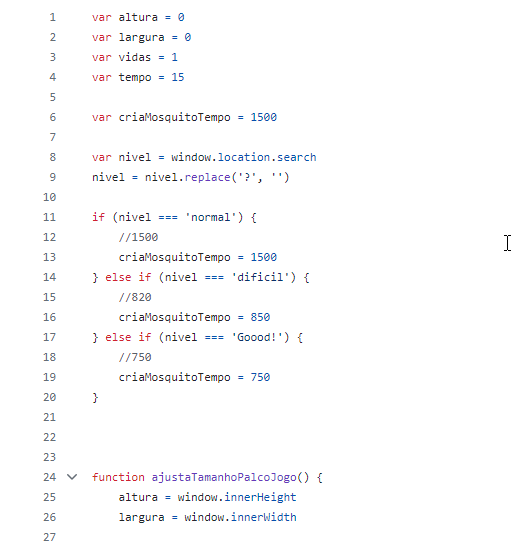

# 10° APP Game - Mata Mosquito

App Game criando com modulo Javascript Avançado.

# Readme Contents:

- [Summary](#summary)
  - [About the project](#about)
  - [screenshot](#screenshot)
- [My code](#codes)
  - [HTML](#html)
  - [CSS](#css)
  - [Javascript](#JS)
- [Process](#process)
  - [Designed](#designed)
  - [Learned](#learned)
- [Autor](#autor)

## summary

### about

Esse App Game foi desenvolvido no modulo de javascript, com alguns conceitos e regras. O intuito desse game é vc eliminar os "Mosquitos" clicando na tela antes do tempo acabar, se você não clicar antes do tempo você perde vida, se as 3 vidas forem zeradas aparece uma tela de game over, se você conseguir clicar antes do elemento subir você ganha o jogo. Esse game possui 3 modos de dificuldade.

### screenshot

## codes

### html

Code HTML

 

### css

Code CSS

 

### JS

Code JS

## process

### designed

- HTML5;
- CSS3;
- Javascript Avançado;
- App Game;
- Semantic HMTL.

### learned

🟢 HTML5;  
🟢 CSS3;  
🟢 Javascript Avançado;  
🟢 Web site.  

## autor

