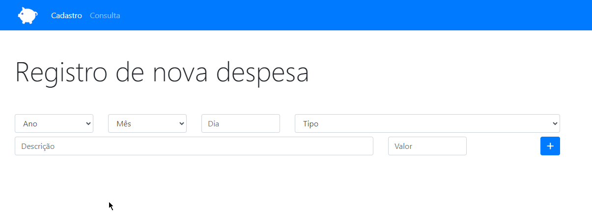
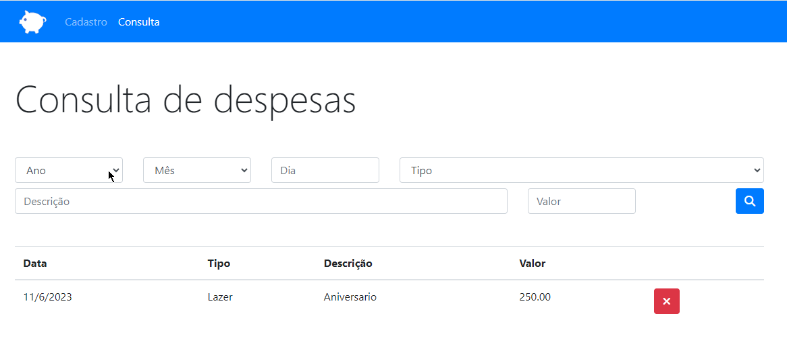
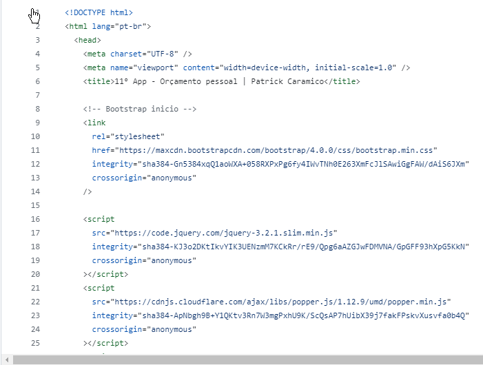
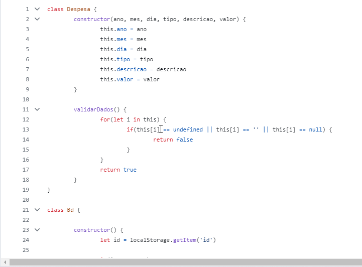

# 11° App - Orçamento Pessoal

Um projeto fictício de orçamento pessoal, desenvolvendo um pouco mais os conhecimentos adquiridos no modulo Javascript Avançado.

# Readme Contents:

- [Summary](#summary)
  - [About the project](#about)
  - [screenshot](#screenshot)
  - [screenConsulta](#screenConsulta)
- [My code](#codes)
  - [HTML](#html)
  - [Javascript](#JS)
- [Process](#process)
  - [Designed](#designed)
  - [Learned](#learned)
- [Autor](#autor)

## summary

### about

Esse App foi desenvolvido como o ultimo projeto do modulo de Javascript Avançado e Bootstrap4, nesse projeto o usuario pode inserir alguns informações que serão armazenadas no armazenamento local do servidor, assim quando o usuario clicar em outra tela " Consulta " o sistema traz as informações que estão armazenadas na rede local, posibilidando o usuario a deletar algum dado.

### screenshot

### screenConsulta

## codes

### html

Code HTML

 

### JS

Code Javascript

 

## process

### designed

- HTML5;
- Javascript Avançado;
- Bootstrap 4;
- Web site;
- App ; 
- Semantic HMTL.

### learned

🟢 HTML5;  
🟢 Javascript Avançado;  
🟢 App;  
🟢 Bootstrap4 ;  
🟢 Armazenado Local.  

## autor

