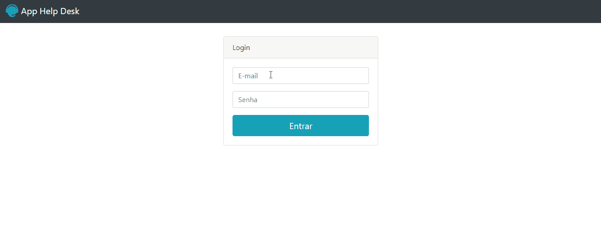
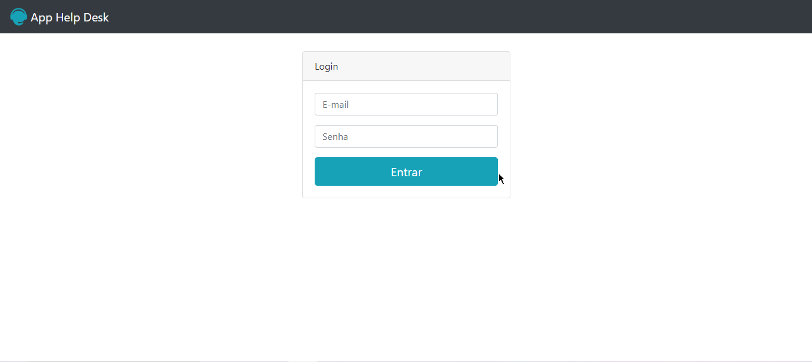
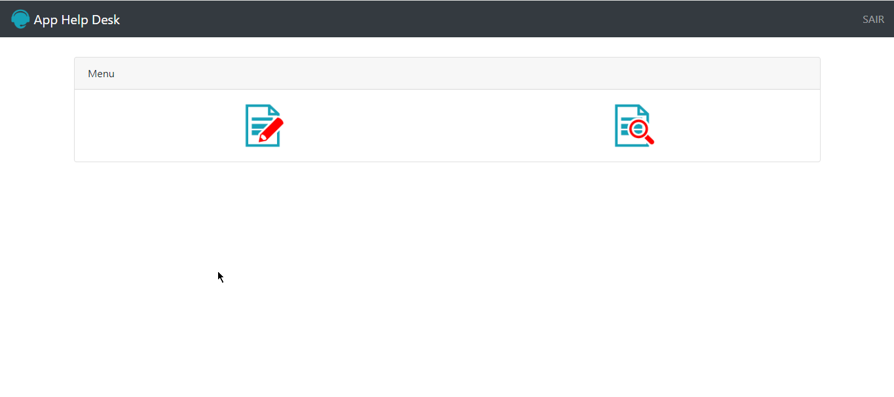
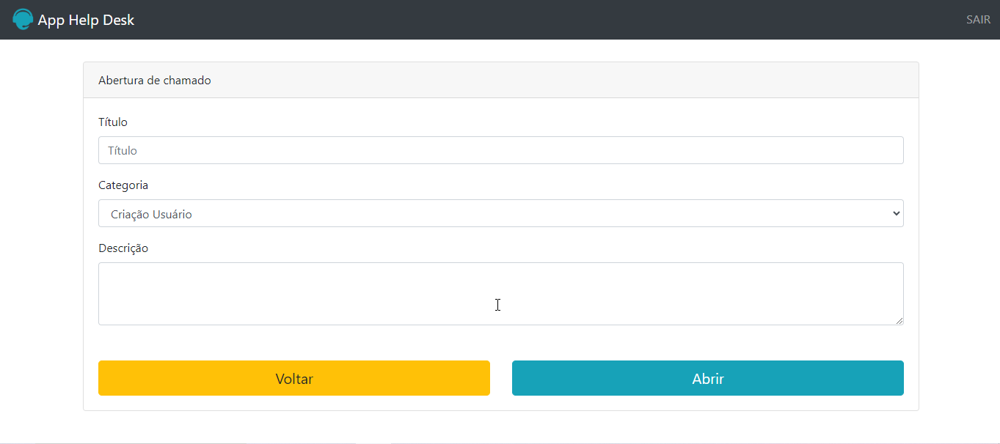
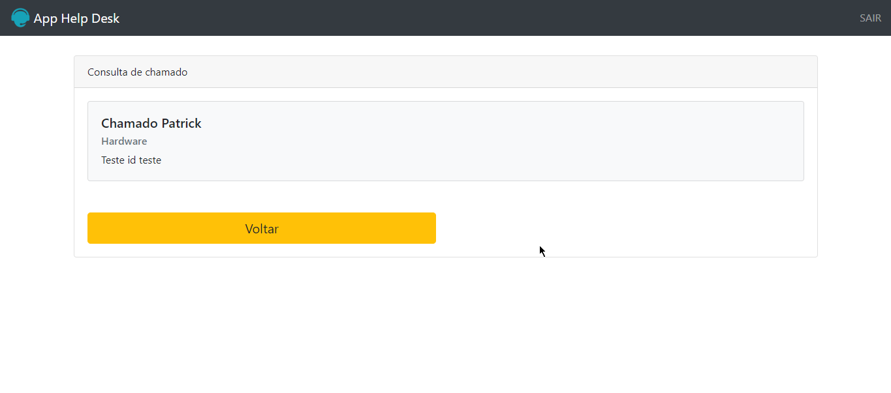
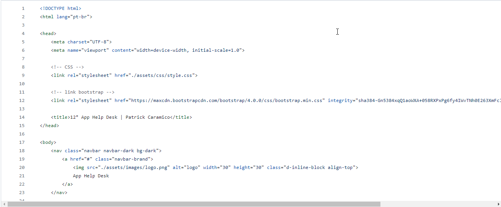
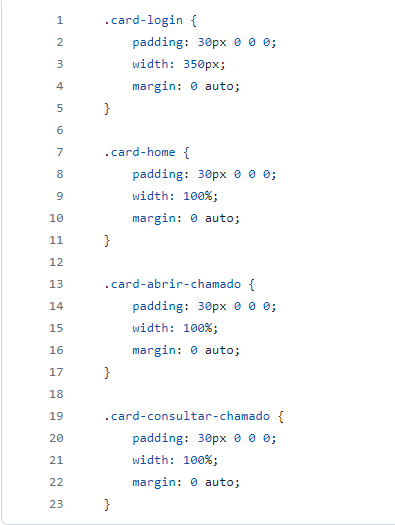

# 12°App-Help-Desk

Software de Help Desk com abertura de chamados e consultas.

# Readme Contents:

- [Summary](#summary)
  - [About the project](#about)
  - [preview](#preview)
  - [screenshot](#screenshot)
- [My code](#codes)
  - [PHP](#php)
  - [CSS](#css)
- [Process](#process)
  - [Designed](#designed)
  - [Learned](#learned)
- [Autor](#autor)
  - [link](#link)
 
## summary

### about

Um software desenvolvido em PHP básico, com intuito de abrir chamados e realizar consultas, nesse software possui um sistema criptografado de usuarios, atualmente esse sistema possui 3 cadastros. Para acessar o sistema pode utilizar o seguinte usuario: user@teste.com senha: 1234.

### preview

 

### screenshot

 

 

 

## codes

### php

Code PHP

 

### css

Code CSS

 

## process

### designed

- Modelo Help Desk;
- PHP7 Básico;
- Bootstrap4;
- App. 

### learned

🟢 PHP7;  
🟢 Help Desk;  
🟢 Bootstrap4;  
🟢 Armazenamento local.  

## autor

### link

**link to acess the project**
