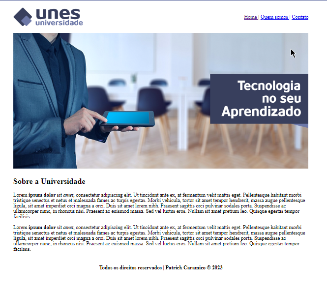
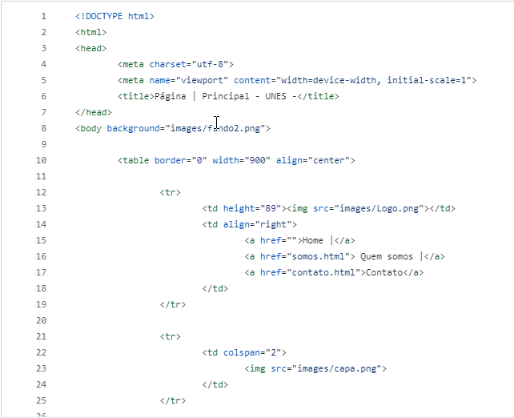

# 1° Projeto - Unes

Um projeto fictício, desenvolvido através do curso Desenvolvimento Web. O intuito desse projeto era contruir uma página simples utilizando principios básicos de HTML.

# Readme Contents:

- [Summary](#summary)
  - [About the project](#about)
  - [screenshot](#screenshot)
- [My code](#codes)
  - [HTML](#html)
- [Process](#process)
  - [Designed](#designed)
  - [Learned](#learned)
- [Autor](#autor)

## summary

### about

Esse foi o 1° Projeto do modulo de HTML5. Utilizamos um web site simples somente com HTML5 e posicionamento de imagens.

### screenshot

## codes

### html

Code HTML

 

## process

### designed

- HTML5;
- Web site;
- Semantic HMTL.

### learned

🟢 HTML5;  
🟢 Semantic HTML;  
🟢 Web site.  

## autor

