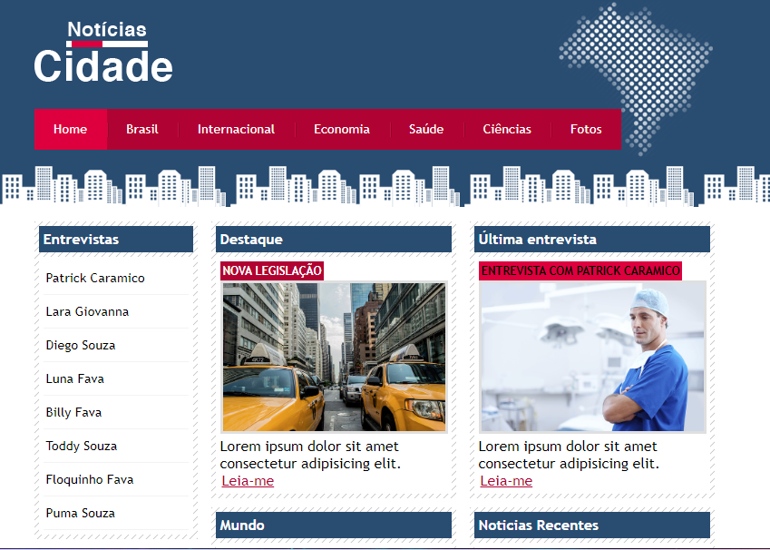
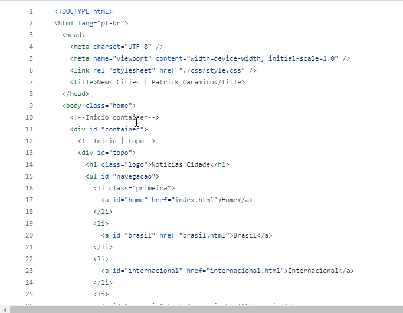
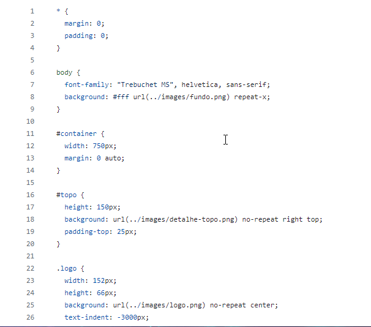

# 4° Projeto Cities

Um projeto fictício, desenvolvido através do curso Desenvolvimento Web. O intuito desse projeto era contruir uma página intermediaria utilizando principios de HTML5 e CSS3 intermediarios.

# Readme Contents:

- [Summary](#summary)
  - [About the project](#about)
  - [screenshot](#screenshot)
- [My code](#codes)
  - [HTML](#html)
  - [CSS](#css)
- [Process](#process)
  - [Designed](#designed)
  - [Learned](#learned)
- [Autor](#autor)

## summary

### about

Esse foi o 4° Projeto do modulo de CSS3 intermediario. Utilizamos um web site em formado de um blog para um site de noticias com estilos CSS3, esse blog possui interações com outros links e formados de imagens.

### screenshot

## codes

### html

Code HTML

 

### css

Code CSS

 

## process

### designed

- HTML5 intermediario 
- CSS3 intermediario;
- Web site;
- Semantic HMTL.

### learned

🟢 HTML5 intermediario;  
🟢 CSS3 intermediario;  
🟢 Web site.  

## autor

