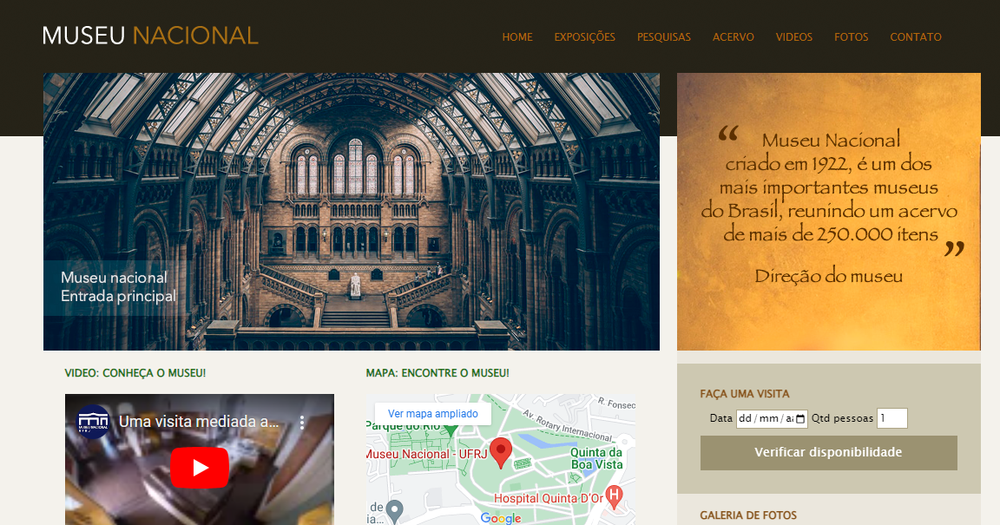
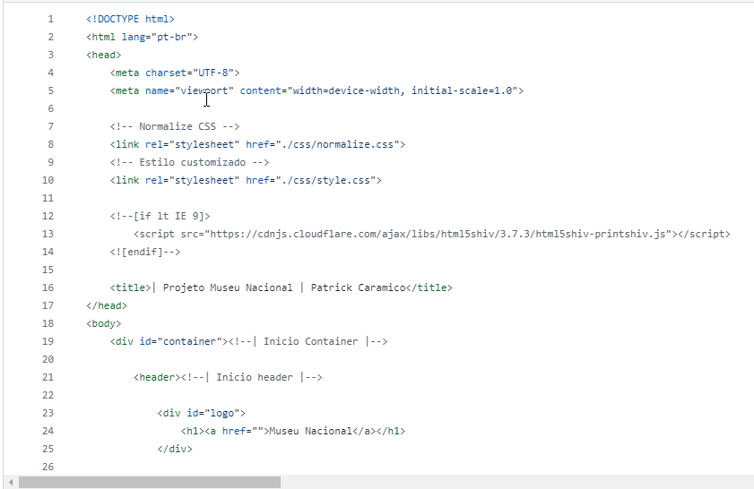
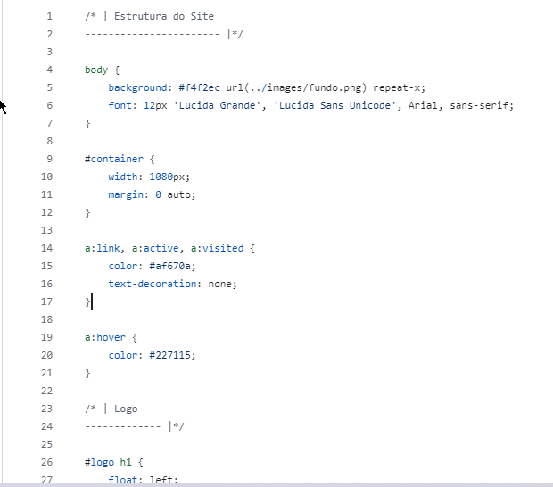

# 6° Projeto - Museu

Um projeto fictício, desenvolvido através do curso Desenvolvimento Web. O intuito desse projeto era contruir uma página mais avançado com alguns recursos especiais utilizando principios avançados do HTML5 e CSS3.

# Readme Contents:

- [Summary](#summary)
  - [About the project](#about)
  - [screenshot](#screenshot)
- [My code](#codes)
  - [HTML](#html)
  - [CSS](#css)
- [Process](#process)
  - [Designed](#designed)
  - [Learned](#learned)
- [Autor](#autor)

## summary

### about

Esse foi o 6° Projeto do modulo de CSS3 avançado com recursos especiais e o normalize CSS3. Utilizamos um web site em formado de um blog para um site de museu com estilos CSS3 avançado, esse blog possui interações com outros links, formados de imagens, interação com Maps e o video de youtube.

### screenshot

## codes

### html

Code HTML

 

### css

Code CSS

 

## process

### designed

- HTML 5 avançado;
- CSS3 avançado;
- Web site;
- Semantic HMTL.

### learned

🟢 HTML5;  
🟢 CSS3;  
🟢 Web site.  

## autor

