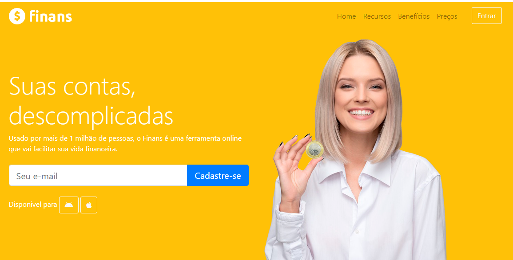
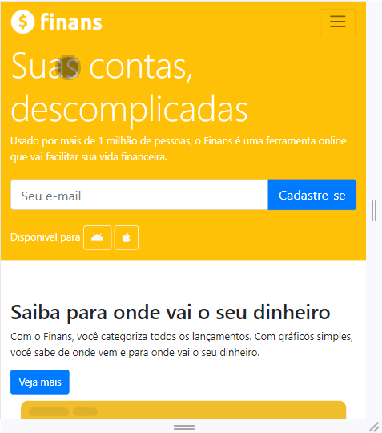
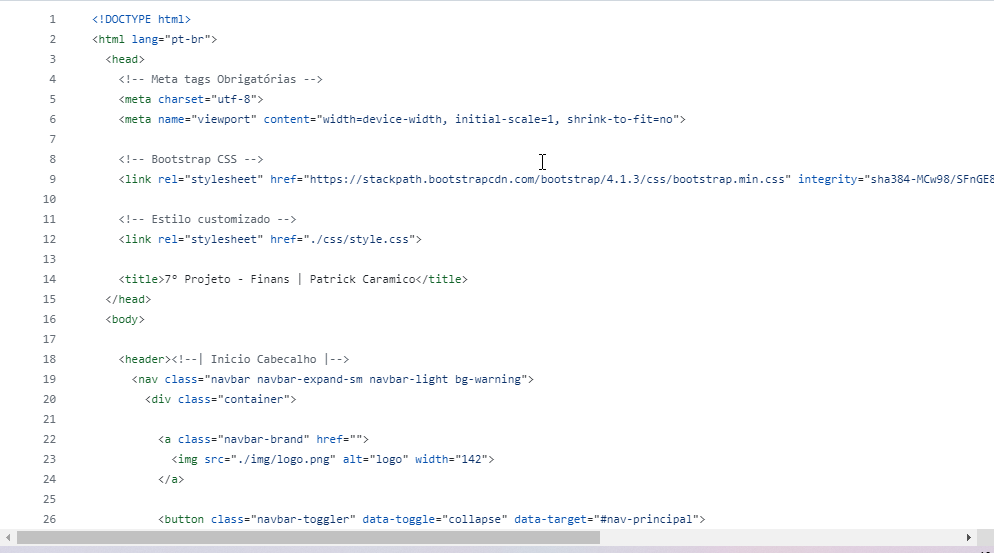
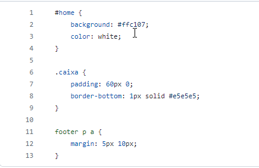

# 7° Projeto - Finans

Um projeto fictício, desenvolvido através do curso Desenvolvimento Web. O intuito desse projeto era contruir uma página avançada com o Bootstrap4 e desing responsivo.

# Readme Contents:

- [Summary](#summary)
  - [About the project](#about)
  - [screenshot](#screenshot)
  - [Bootstrap4](#screenBootstrap)
- [My code](#codes)
  - [HTML](#html)
  - [CSS](#css)
- [Process](#process)
  - [Designed](#designed)
  - [Learned](#learned)
- [Autor](#autor)

## summary

### about

Esse foi o 7° Projeto do modulo de Bootstrap4, Utilizamos um web site mais avançado com os conhecimentos adquiridos nos modulos anteriores, nesse projeto utilizamos o Bootstrap4 e design responsivo para o web site.

### screenshot

### screenBootstrap

## codes

### html

Code HTML

 

### css

Code CSS

 

## process

### designed

- HTML5;
- CSS3;
- Web site;
- Semantic HMTL;
- Bootstrap4. 

### learned

🟢 HTML5;  
🟢 CSS3;  
🟢 Web site;  
🟢 Bootstrap4;  
🟢 Design responsivo . 

## autor

