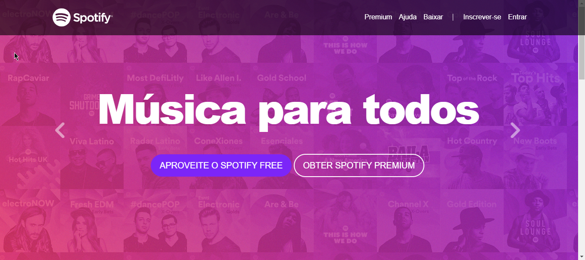
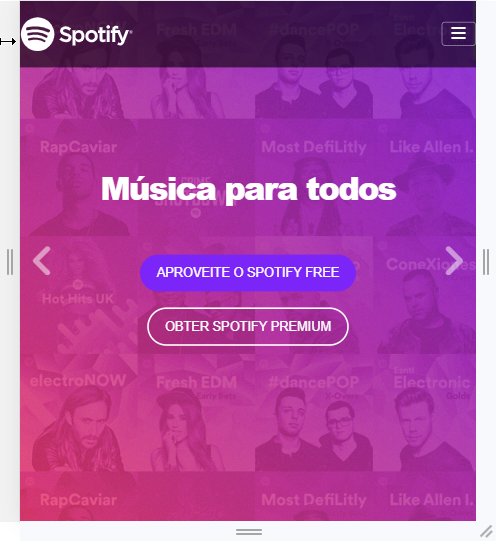
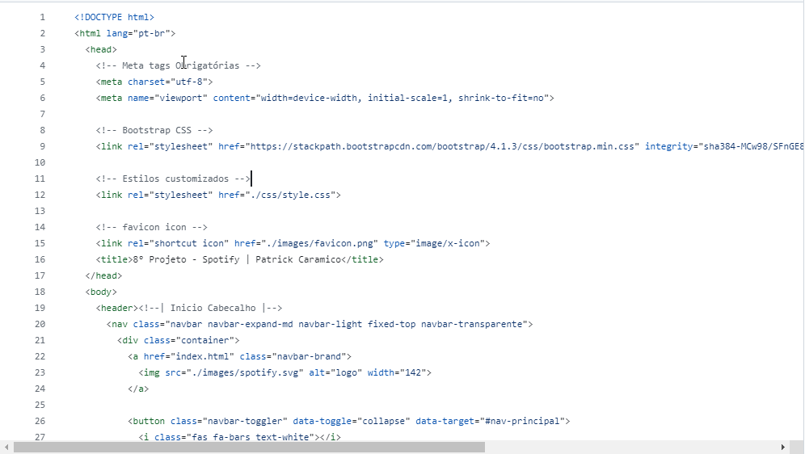
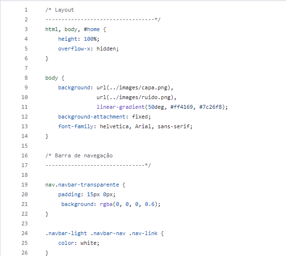

# 8° Projeto - Spotify

Um projeto fictício e clone do Spotify, desenvolvido através do curso Desenvolvimento Web. O intuito desse projeto clonar a página inicial do Spotify com os conhecimentos adquiridos nos modulos anteriores e conhecimentos do Bootstrap4.

# Readme Contents:

- [Summary](#summary)
  - [About the project](#about)
  - [screenshot](#screenshot)
  - [Bootstrap4](#screenBootstrap)
- [My code](#codes)
  - [HTML](#html)
  - [CSS](#css)
- [Process](#process)
  - [Designed](#designed)
  - [Learned](#learned)
- [Autor](#autor)

## summary

### about

Esse foi o 8° Projeto do modulo de Boostrap4. Utilizamos a tela de inicial do Spotify antigo como modelo para criação desse clone, com os conhecimentos adquiridos nos modulos anteriores conseguimos criar esse site.

### screenshot

### screenBootstrap

## codes

### html

Code HTML

 

### css

Code CSS

 

## process

### designed

- HTML5;
- CSS3;
- Web site;
- Semantic HMTL;
- Bootstrap4;
- Clone Spotify.

### learned

🟢 HTML5;  
🟢 CSS3;  
🟢 Web site;  
🟢 Bootstrap4.  

## autor

