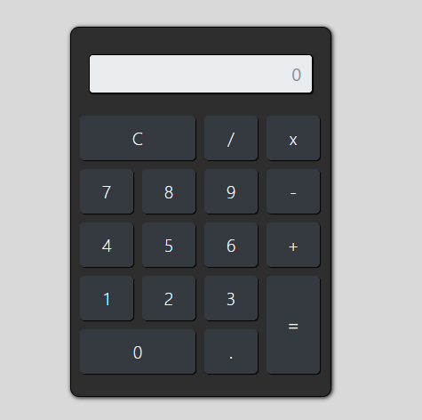
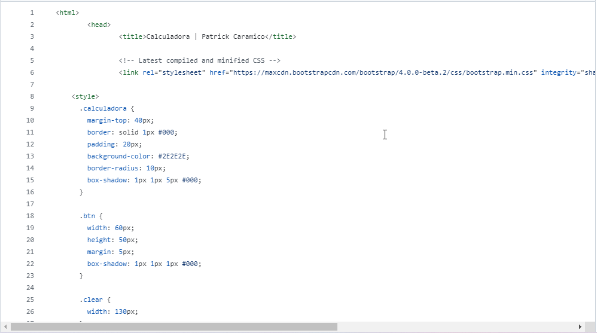
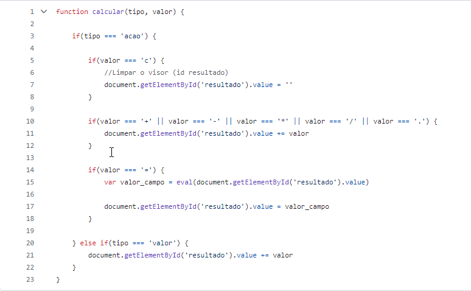

# 9° APP Game - Calculadora

Projeto de calculadora criada atrávezs do modulo Javascript

# Readme Contents:

- [Summary](#summary)
  - [About the project](#about)
  - [screenshot](#screenshot)
- [My code](#codes)
  - [HTML](#html)
  - [Javascript](#JS)
- [Process](#process)
  - [Designed](#designed)
  - [Learned](#learned)
- [Autor](#autor)

## summary

### about

Esse projeto foi um app criado através do modulo Javascript simples, o ituito era criar esse app com alguns conhecimentos básicos nesse modulo.

### screenshot

## codes

### html

Code HTML

 

### JS

Code Javascript

 

## process

### designed

- HTML 5:
- Javascript;
- App Game;
- Semantic HMTL.

### learned

🟢 HTML5;  
🟢 Javascript;  
🟢 App Game.  

## autor

