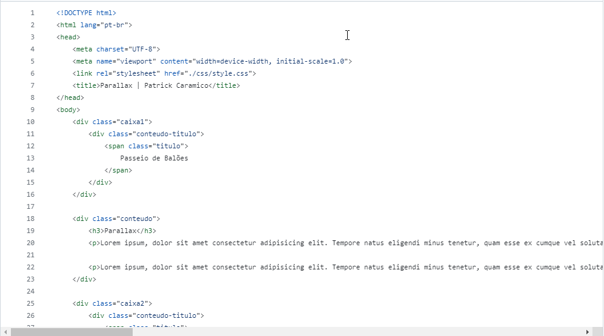
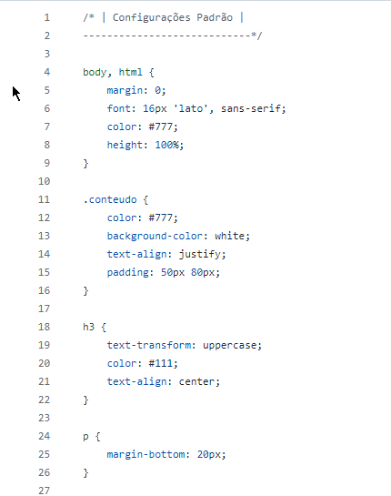

# Efeito - Parallax

Um projeto fictício com efeito parallax, desenvolvido através do curso Desenvolvimento Web. O intuito desse projeto é fazer o efeito parallax com algumas imagens

# Readme Contents:

- [Summary](#summary)
  - [About the project](#about)
  - [screenshot](#screenshot)
- [My code](#codes)
  - [HTML](#html)
  - [CSS](#css)
- [Process](#process)
  - [Designed](#designed)
  - [Learned](#learned)
- [Autor](#autor)

## summary

### about

Esse foi o efeito parallax, com algumas imagens e alguns texto em lorem e titulos.

### screenshot

## codes

### html

Code HTML

 

### css

Code CSS

 

## process

### designed

- HTML5;
- CSS3;
- Parallax;
- Semantic HMTL.

### learned

🟢 HTML5;  
🟢 CSS3;  
🟢 Parallax.  

## autor

